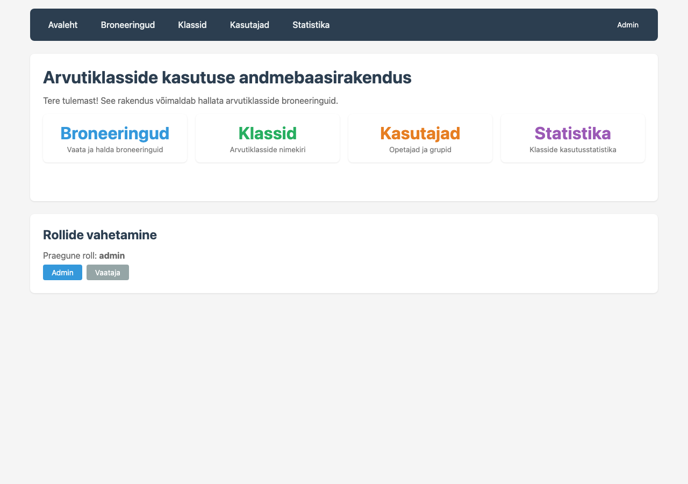
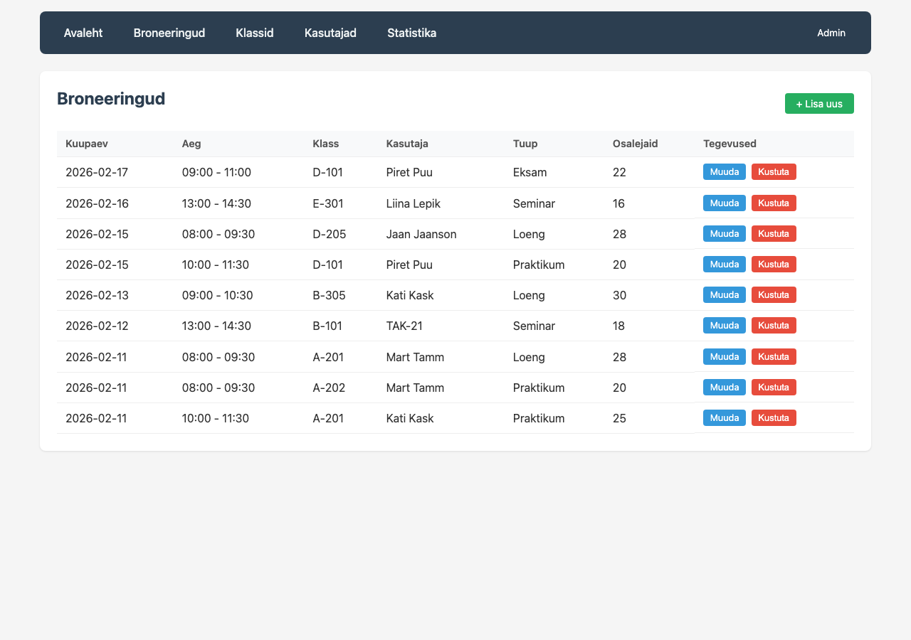
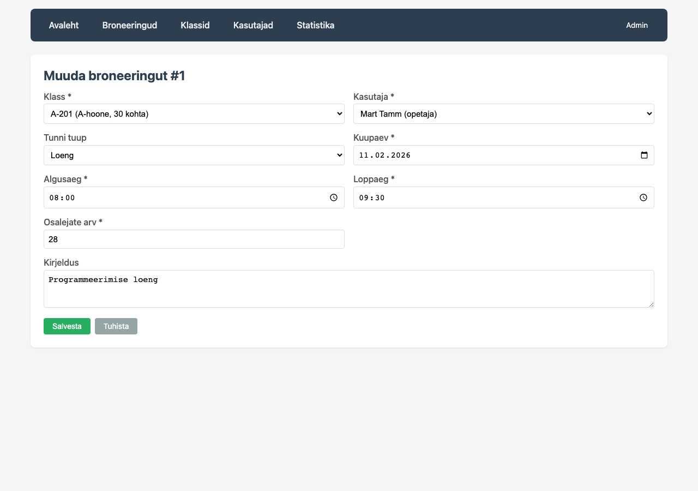
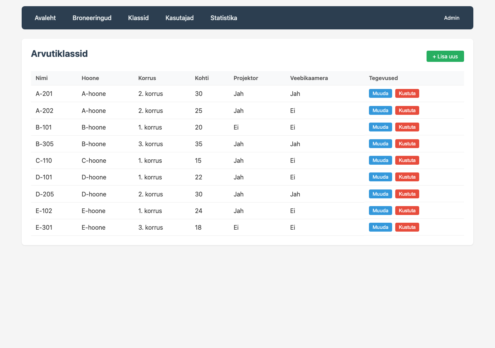
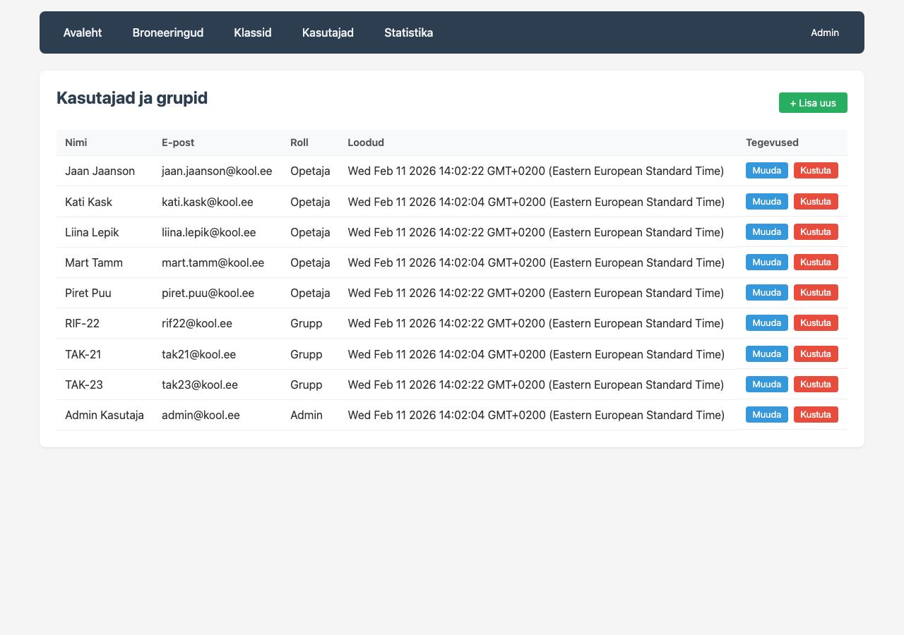
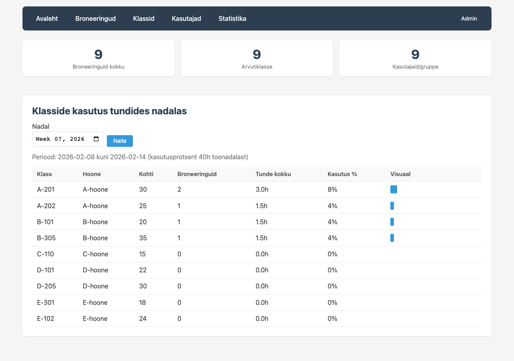
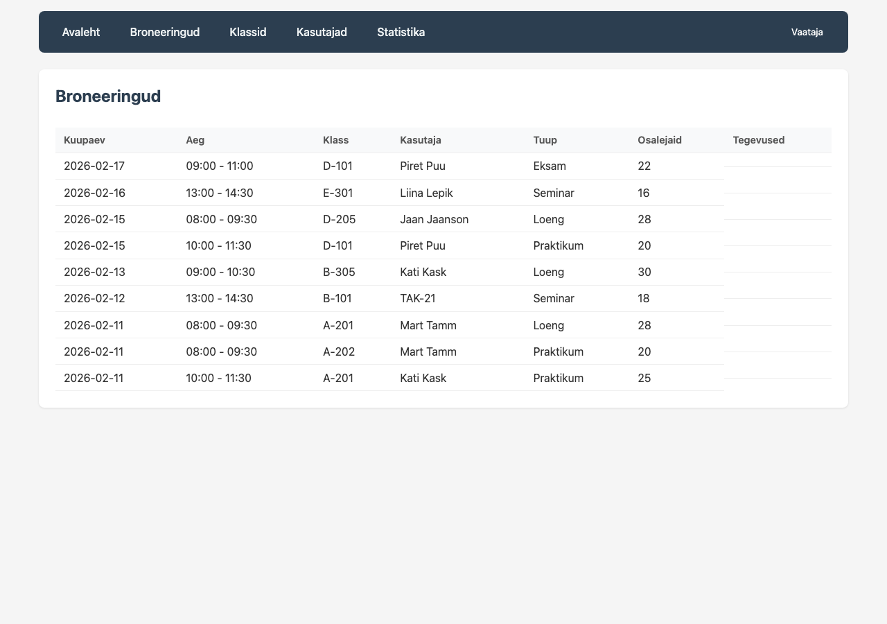

# Arvutiklasside kasutuse andmebaasirakendus

Veebirakendus arvutiklasside broneerimise haldamiseks. Projekt on loodud
TAK25 grupi andmebaaside kursuse raames.

## Tehnoloogia

- **Bun** - JavaScripti runtime
- **Hono** - veebiraamistik
- **MySQL** - andmebaas (mysql2)
- **HTMX** - interaktiivsus ilma raskete raamistiketeta

## Kaivitamine

### Eeldused

Arvutisse peab olema paigaldatud:
- [Bun](https://bun.sh) - JavaScripti runtime
- [MySQL](https://dev.mysql.com/downloads/) - andmebaasiserver

```bash
# Bun paigaldamine
curl -fsSL https://bun.sh/install | bash

# MySQL kaivitamine (macOS Homebrew)
brew services start mysql

# Andmebaasi loomine
mysql -u root < ../schema.sql
```

### Paigaldamine ja kaivitamine

```bash
# Soltuvuste paigaldamine
cd app
bun install

# Arendusserver (hot reload)
bun run dev

# Voi tavaline kaivitus
bun run start
```

Server kaivitub aadressil: **http://localhost:3001**

## Kasutamine

### Rollid

Rakenduses on kaks rolli, mida saab vahetada URL parameetriga:

- **Admin**: `http://localhost:3001/?role=admin` - taielikud oigused (vaikimisi)
- **Vaataja**: `http://localhost:3001/?role=viewer` - ainult lugemise oigused

### Pohifunktsioonid

- **Broneeringud** (`/bookings`) - broneeringute nimekiri, lisamine, muutmine, kustutamine
- **Klassid** (`/classrooms`) - arvutiklasside haldamine
- **Kasutajad** (`/users`) - opetajate ja gruppide haldamine
- **Statistika** (`/stats`) - klasside kasutusstatistika tundides nadalas

## Import/Eksport

### Andmete import

```bash
bun run import
```

Impordib andmed kolmest formaadist:
- `import/classes.csv` - klassiruumid (CSV)
- `import/teachers.json` - opetajad/grupid (JSON)
- `import/bookings.xml` - broneeringud (XML)

### Andmete eksport

```bash
bun run export
```

Ekspordib:
- `export/bookings_summary.csv` - broneeringute koondtabel
- `export/top5_classes.json` - Top 5 kasutatumad klassid

## Varundamine

```bash
bun run backup
```

Loob varukoopia kausta `backup/`:
- `backup_YYYY-MM-DD.sql` - SQL dump
- `backup_YYYY-MM-DD.db` - andmebaasi koopia

## Projekti struktuur

```
app/
  src/
    index.ts          # Peamine server
    db.ts             # Andmebaasi yhendus ja seemnamine
    middleware/
      auth.ts         # Rollipohine ligipaaes
    routes/
      bookings.ts     # Broneeringute CRUD
      classrooms.ts   # Klasside CRUD
      users.ts        # Kasutajate CRUD
      stats.ts        # Statistikavaade
    views/
      layout.ts       # HTML pohimall
```

## Ekraanipildid

### Avaleht


### Broneeringute nimekiri (Admin)


### Uue broneeringu lisamine


### Broneeringu muutmine


### Arvutiklassid


### Kasutajad ja grupid


### Statistikavaade


### Vaataja roll (nupud peidetud)

